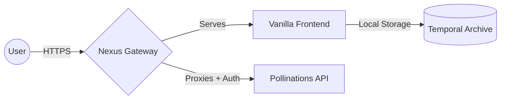

# NEXUS // VISION

### [ Sovereign AI Image Synthesis Lab ]

**Nexus Vision** is a high-performance, dark-themed visual workstation designed for rapid AI image generation. It follows the "Sovereign Proxy" philosophy: providing maximum utility with absolute minimum bloat, operating entirely without external dependencies or heavy frameworks.

---

## ⚡ The Philosophy: Maximum Utility // Zero Bloat

- **Dependency-Free Vanilla Stack**: Built with pure HTML5, CSS3 (Tailwind-driven), and Vanilla JavaScript. No `npm install`, no `node_modules`, no build steps. 
- **Sovereign Proxy Architecture**: All sensitive operations (API key management, secure routing) are handled by a backend Caddy gateway. The frontend remains "keyless" and secure.
- **Privacy First**: Your prompt history and synthesis archive stay entirely in your browser's local storage. No tracking, no external databases.

## ✨ Core Features

- [x] **Dynamic Model Discovery**: Automatically fetches the latest visual engines from Pollinations.ai, categorized by cost and capability (Image, Token-Based, Pro).
- [x] **Neural Prompt Augmentation**: Integrated "Enhance Vision" tool powered by xAI Grok 4 (Medium) to transform simple ideas into complex, cinematic prompts.
- [x] **Temporal Archive**: An Apple Photo Booth-style horizontal filmstrip that saves your history and allows one-tap restoration of all parameters (Prompt, Seed, Ratio, Model).
- [x] **Live Pollen Wallet**: Real-time high-precision tracking of your Pollinations.ai credits and dynamic "Remaining Synthesis" calculation per model.
- [x] **Multi-Parameter Synthesis**: Full control over Aspect Ratio (Square, Wide, Tall), Fixed Seeds, and Negative Prompts.
- [x] **One-Tap Actions**: Copy generated visions directly to your system buffer or download them for permanent storage.

## 🏗️ Architecture

1. **Edge Gateway (Caddy)**: Handles SSL, CORS, and injects API keys securely.
2. **Logic Layer (Grok/Gemini)**: Powers the prompt expansion and metadata discovery.
3. **Synthesis Engine (Pollinations)**: Provides the heavy lifting for FLUX, SDXL, and more.

## 🚀 Deployment

Designed to be hosted on any static file server or proxied through a modern web server like Caddy. Simply point your root to `index.html` and let the Nexus handle the rest.

---
*Powered by Pollinations.ai & The Nexus Sovereign Network*